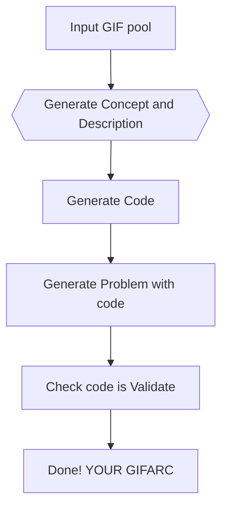

 
# GIFARC 🌟  
**Synthetic Dataset for Leveraging Human‑Intuitive Analogies to Elevate AI Reasoning**

[](https://neurips.cc/) 
[](https://huggingface.co/datasets/DumDev/gif_arc) 
[](LICENSE) 
[](https://github.com/)

> **GIFARC** distills the magic of everyday analogies into a rigorously curated, GIF‑centric benchmark that pushes large language models (LLMs) beyond pattern matching toward **genuine reasoning**.

---

## ✨ TL;DR

* **10k** ARC style puzzles made from GIF with analogy.  
* Pair‑wise **ground‑truth mappings** + rich **textual rationales** for supervised or in‑context use.  
* **Easy Play generation pipeline** – extend or remix new analogy families with gif in a few minute.
* **Friendly Hugging Face dataset** & interactive **web demo** for instant exploration
 

## Table of Contents
1. [Quick Start](#rocket-quick-start)  
2. [Dataset Card](#open_file_folder-dataset-card)  
3. [Pipeline Overview](#factory-pipeline-overview)  
4. [Project Structure](#file_cabinet-project-structure)
5. [Citing GIFARC](#bookmark_tabs-citing-gifarc)
6. [Contributing](#handshake-contributing)
7. [Acknowledgements](#sparkles-acknowledgements)
8. [License](#scroll-license)

---

## :rocket: Quick Start

### 1. Install

We highly command to using docker. To setting with docker check [SETUP.md](docs/SETUP.md)

```bash
git clone https://github.com/DumDev/gifarc.git
cd gifarc
pip install -r requirements.txt
pip install -r requirements-dev.txt      
````

### 2. Pull the Dataset

```python
from datasets import load_dataset
ds = load_dataset("DumDev/gif_arc")
```

### 3. Generate Your Own GIFARC

Once your Set up is down Open `description_executor.ipynb` and run the code here

### 4. Check the Web Demo

[GIFARC Web Demo](https://gifarc.vercel.app/v1.1)

---

## \:open\_file\_folder: Dataset Card

| Split | #Tasks | #Unique GIFs | Max. Frames |   Size |
| ----- | -----: | -----------: | ----------: | -----: |
| Train |  10000 |      10000   |       30*30 |   < 24 MB |


*Every task packages → *   
```json
{
  "source": "<source code>", # python code string
  "examples": [
      [<input_grid_1>,<output_grid_1>], # pair 1
      [<input_grid_2>,<output_grid_2>], # pair 2
      ...
    ], 
  "seeds": [
      "<file_name_1>",
      "<file_name_2>",
      ...,
      "<file_name_N>",
      "<Concept_and_description>"
    ], 
  "url": "<minified_url>"
}
```
See the full [🤗 dataset card](https://huggingface.co/datasets/DumDev/gif_arc) for licensing, intended use, and data statements.

---

## \:factory: Pipeline Overview



* **Modular & Easy generation** – After put GIF in data/GIF, just click all run button at `description_executor.ipynb` to generate Your own data! 
* **Stable environment setting** enable easy set up with docker and devcontainer
* All intermediate artifacts are cached for reproducibility.

Detailed instructions live in **[GENERATION.md](docs/GENERATION.md)**.

---

## \:file\_cabinet: Project Structure

```
./GIFARC
├── data
│   └── GIF
├── description_executor.ipynb # use this to execute
├── docker-compose.yml
├── docs
│   ├── EXPERIMENTS.md
│   ├── GENERATION.md
│   ├── project_directory_tree.txt
│   └── SETUP.md
├── loggings
├── README.md
├── requirements-dev.txt
├── requirements.txt
├── results # this will generate automatically
└── src
    ├── execution.py
    ├── experiments.py
    ├── generate_descriptions.py
    ├── generate_problems.py
    ├── generate_visualization_html.py
    ├── GIFARC_data_batch
    ├── GIFARC_utils
    ├── misc
    ├── parse_batch_description_samples.py
    ├── prompts
    ├── seeds
    ├── utility
    └── visualize_problems.py
```

---

## \:bookmark\_tabs: Citing GIFARC

```bibtex
@misc{gifarc2025,
  title   = {GIFARC: Synthetic Dataset for Leveraging Human-Intuitive Analogies to Elevate AI Reasoning},
  author  = { Anonymous },
  year    = {2025},
  note    = {Under review at NeurIPS Datasets & Benchmarks 2025},
  url     = {}
}
```

---

## \:handshake: Contributing

Pull requests are welcome! Please:

1. Create a new branch from `main`.  
2. Add tests for new features (`pytest -q`).  
3. Run `pre-commit run --all-files`.  
4. Open a PR and describe your changes clearly.  

---

## \:sparkles: Acknowledgements

* **GIPHY** for powering the GIF search API
* **BARC** – our generation pipeline stands on the shoulders of this excellent project
* GIFARC wouldn’t be possible without the open‑source community and our amazing reviewers.

---

## \:scroll: License

Distributed under the **MIT License**. See [`LICENSE`](LICENSE.md) for details.

```

Feel free to tweak badges, stats, or any placeholders (`TBW`) once results and acceptance details are finalized. Happy publishing!
 
