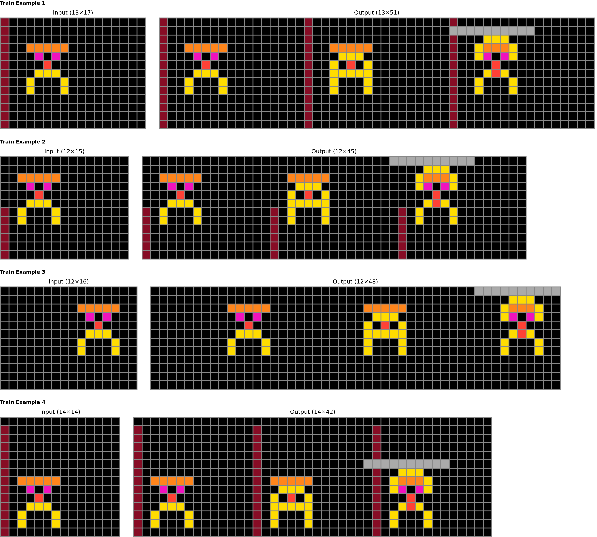

# GIFARC: A GIF-Derived Resource for Analogy-Guided Task Framing


> By embedding robust human-intuitive analogies into ARC-style tasks, GIFARC guides AI agents to evaluate the task analogically before engaging in brute-force pattern search, thus efficiently reducing problem complexity and build a more concise and human-understandable solution.

---

 
  
## TL;DR

* **1,614** ARC style puzzles made from GIF with analogy.  
* Pair‑wise **ground‑truth mappings** + rich **textual rationales** for supervised or in‑context use.  
* **Easy Play generation pipeline** - extend or remix new analogy families with gif in a few minutes.
* Review artifacts and generated examples are distributed through the anonymous supplementary material during double-blind review.


## Table of Contents
1. [Quick Start](#rocket-quick-start)  
2. [Dataset Card](#open_file_folder-dataset-card)  
3. [Pipeline Overview](#factory-pipeline-overview)  
4. [Project Structure](#file_cabinet-project-structure)
5. [Citing GIFARC](#bookmark_tabs-citing-gifarc)
6. [Acknowledgements](#sparkles-acknowledgements)
7. [License](#scroll-license)

---

## Quick Start

### 1. Install

We highly command to using docker. To setting with docker check [SETUP.md](docs/SETUP.md).  

```bash
git clone <GIT_url>
cd gifarc
pip install -r requirements.txt
pip install -r requirements-dev.txt      
````

### 2. Use Review Artifacts

During double-blind review, use the dataset bundle from the anonymous supplementary material. Place downloaded JSONL files under a local artifact directory and keep large raw outputs out of Git.
Raw GIF files, source GIF URLs, and generated result dumps are not bundled in this software repository.

### 3. Generate Your Own GIFARC

Place your own GIF files under `data/GIF/`, then open `description_executor.ipynb` and run the pipeline cells.

### 4. Check the Web Demo

[GIFARC Web Demo](https://gifarc.vercel.app).

---

## Dataset Card

| Split | #Tasks | #Unique GIFs |    Size |
| ----- | -----: | -----------: |  -----: |
| Train | 1,614 |    1,614    | < 100 MB |


Every task packages looks as follows:    
```
{
  "source": "<source code>", # python code string
  "examples": [
      [<input_grid_1>,<output_grid_1>], # pair 1
      [<input_grid_2>,<output_grid_2>], # pair 2
      ...
    ], 
  "seeds": [
      "<file_name_1>",
      "<file_name_2>",
      ...,
      "<file_name_N>",
      "<Concept_and_description>"
    ], 
  "url": "<minified_url>"
}
```
See the anonymous supplementary material for licensing, intended use, and data statements during review.

---

## Pipeline Overview


* **Modular & Easy generation** – Place review-safe GIF inputs under `data/GIF/`, then run `description_executor.ipynb` to generate local outputs.
* **Stable environment setting** enable easy set up with docker and devcontainer.  
* All intermediate artifacts are cached for reproducibility.

Detailed instructions live in **[GENERATION.md](docs/GENERATION.md)**.

---

## Project Structure

```
./GIFARC
├── data
│   └── GIF
├── description_executor.ipynb # use this to execute
├── docker-compose.yml
├── docs
│   ├── ANONYMIZATION.md
│   ├── GENERATION.md
│   ├── SETUP.md
│   └── THIRD_PARTY_NOTICES.md
├── README.md
├── requirements-dev.txt
├── requirements.txt
└── src
    ├── execution.py
    ├── experiments.py
    ├── generate_descriptions.py
    ├── generate_problems.py
    ├── generate_visualization_html.py
    ├── GIFARC_data_batch
    ├── GIFARC_utils
    ├── misc
    ├── parse_batch_description_samples.py
    ├── prompts
    ├── seeds
    ├── utility
    └── visualize_problems.py
```

Generated outputs such as `results/`, `experiment_results/`, `loggings/`, and caches are intentionally ignored.

---


### Citing GIFARC

```bibtex
@misc{anonymous2026gifarc,
  title={GIFARC: A GIF-Derived Resource for Analogy-Guided Task Framing},
  author={Anonymous Authors},
  note={Under review},
  year={2026}
}
```

---

## Acknowledgements

* **GIPHY** for powering the GIF search API.  
* **BARC** – our generation pipeline stands on the shoulders of this excellent project.  
* Some seed-program filenames preserve upstream identifiers for reproducibility; see [Third-Party Notices](docs/THIRD_PARTY_NOTICES.md).
* GIFARC wouldn’t be possible without the open‑source community and our amazing reviewers.

---

## License

Distributed under the **MIT License**.
